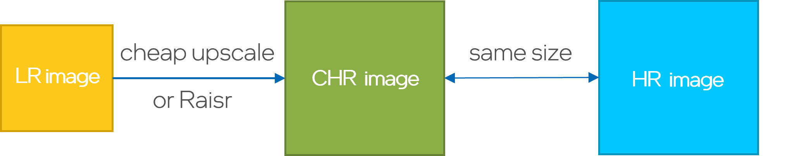
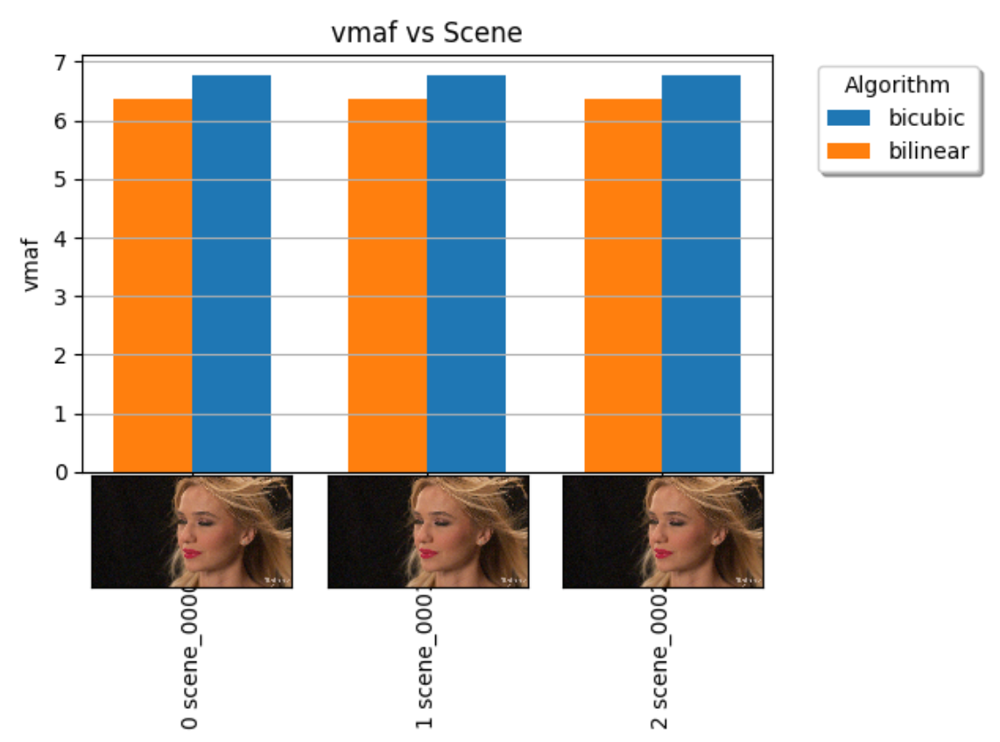
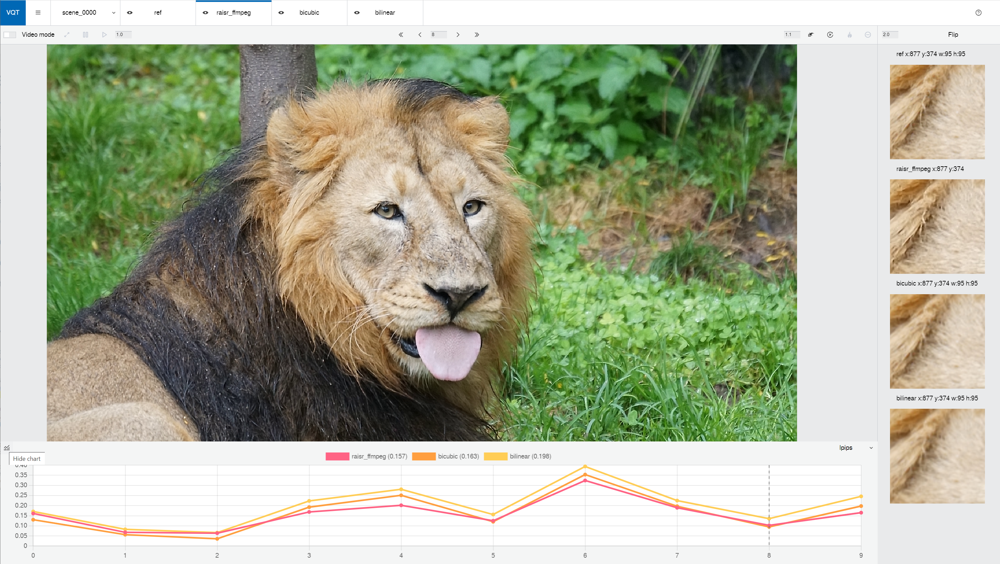

# Banzai Beach (Framework for AI Media Enhancement)
Banzai Beach is the code name for the Framework for AI Media Enhancement and is named for the famous beach in Pupukea, Hawaii. This beach is best known for the Banzai pipeline, a challenging series of barreling waves for only the best surfers. Given the pipeline architecture of this framework, it is an appropriate name choice.

This framework is intended to be used for the testing and training of various AI algorithms for Media Enhancement including Video Super Resolution (VSR) algorithms. It supports a full pipeline of steps from downloading videos, performing scene detection and extraction, inference from a trained VSR neural network model, and collecting metrics to evaluate the super resolution results.

In the current version, Banzai Beach only support functions that related to Raisr(Dataset preparation, training, testing, metrics calculation, comparison, visualization) and also support default algos like bicubic, bilinear, lanczos for reference.
## **Acronyms and Terms**
- **HR images**

   High resolution images,using as the ground truth when train/test super resolution algorithms.
- **LR images**

   Low resolution images, using as train/test data.
- **CHR images**

   Upscaled LR images with the same size as high-resolution images.(Can be generated by using cheap upscale or Raisr,see the **Selections of CHR images** part for detail)

   
- **VMAF**

   VMAF (Video Multi-Method Assessment Fusion) is a relatively new perceptual video quality assessment algorithm and is available from https://github.com/Netflix/vmaf .
- **LPIPS**

   Evaluate the distance between image patches. Higher means further/more different. Lower means more similar.
   Paper:https://arxiv.org/abs/1801.03924.
- **Raisr**

   A super resolution algorithm:
   [Rapid and Accurate Image Super Resolution](http://ieeexplore.ieee.org/document/7744595/)
   that uses LR images as input and outputs super resolution images.

   In the current version of Banzai Beach, we support 2passes training & testing of Raisr.
   - 1pass: Using HR images and LR images to train Raisr, using 1pass trained Raisr filter and LR images to test Raisr.
   - 2pass: Using sharpened HR or HR images and CHR images to train Raisr, using 1pass trained& 2pass trained filters and LR images to test Raisr.

## **Pipeline**

The framework is conceptually one pipeline that defines the sequential flow of processing videos to test and train super resolution algorithms.  Each stage of the pipeline performs a single, specific task.
   
The following pipeline stages are defined:

- Initial - Initialization (mostly a no-op)
- Download - Downloading of videos from the web (e.g. URLs, Vimeo, etc.)
- SceneDetect - Detect scenes (No need in current version)
- Split - Split scenes into individual frames (No need in current version)
- Classify - Classify scene or frame by some metric (e.g. low/medium/high motion) (Currently not implemented)
- Augment - Add noise or apply transformation to the frames ((No need in current version))
- Downscale - Downscale original frame (high resolution/ground truth) into a low resolution frame
- Train - Train VSR model (Only support Raisr in current version)
- Test - Use VSR model to process low resolution frames and create inferred high resolution frames(Support Raisr,bilinear,nearest,area,bicubic,Lanczos)
- Metrics - Gather statistics like PSNR, SSIM, and VMAF on the tested frames vs the original frames 
- Log - log per scene metrics to a csv log file
- Compare - Compare test results within region of interests
- Plot - Create plots of test results.
- Final - Completion (mostly a no-op)

Stages are executed sequentially from Initial to Final.  You can opt to skip stages and you can also execute the framework by starting and ending at specific stages.  For many situations you can sequentially run multiple executions of the framework to complete a task. You can also run a single stage by specifying it as the start and end stage.

The pipeline is configurable by using a comprehensive set of options which are defined in FAIME.py and documented in the config.yaml configuration file.

Only one instance of FAIME.py is allowed at one time so that synchronization between stages can occur.   Do not attempt to start multiple instances.  Rather utilize the multiprocessing parallelize supported in the scripts to effciently use the framework on a specific machine.
## **Important Elements**
### **Project Folder and subfolders**
You will need to define a project folder location which will organize and contain the various subfolders for the framework.  By default this will be the location from which the script is run from however to keep organized it is recommended to define another location. You can set it in setup.sh follow the steps in **Setting Paths** part.

The project folder will be the root location for the various folders created during the framework's execution including the LR, HR, train and test and vqt(compare part).  The database and log file are also stored at this location as well.
This should be location on the system with sufficient storage and write privileges.
### **Configuration**
There are large number of configuration options available for the controlling the behavior of the pipeline.  These are defined in "FAIME.py".  As with other python programs these can be added to the command line as parameters (e.g. python3 FAIME.py --initial_stage scenedetect).

An alternative and preferred method for organizing and passing in parameters is to define them in a yaml formmated parameter file and pass in that filename using the --cfg parameter (e.g. python3 FAIME.py --cfg config_files/test_bilinear.yaml).

There are various config files under `config_files` to complete different situations. You can choose one according to your need and also can create you own config yaml according to `FAIME/config.yaml` following the steps in the **Run Multi-steps As You Need** part. The subsequent parts: **Train Raisr**, **Testing**, **Metrics Evaluate**, **Comparison & Visualization** will teach you how to use single config files under `config_files` to train & test & metrics & compare, too.

### **Database**
The database" is a human-readable json file which first gets generated during the scenedetect phase.  It is called `database.json` and is created in the project folder.  It is organized by scene and every scene has a number of parameters including video name, number of frames, width, height, and metrics.

If you want to run the framework on an existing project without a database file, set `database_build: "True"` in your config yaml file. A skeleton database file will be created based on the data in the project folder. With this `database.json` file, it will allow the framework  to run the train, test, metrics, log, compare stages according to this json file and update corresponding data into this json.

Every time the framework starts it will log a list of the current scenes in the database.

The framework will generate a scene_sheet.png file in the project folder whenever scenes are added or removed from the database.  This image file contains thumbnails and other meta information about the scenes.

Also you can restrict processing to specific scenes using the "individual_scenes" option.  For example to only do testing and metric collection on scenes 2,4,5, set: `individual_scenes: "2,4,5"` in your config file.

You can also delete scenes in the database using the `database_remove_scenes` option. For example to remove scenes 2,4,5, set: `database_remove_scenes: "2,4,5"` in your config file.
### **Multiprocessing**
Several of the stages are implemented using multiprocessing logic.  This has the benefit of speeding up the processing as multiple cpus can be working simultaneously on independent framework activities.  Only processing within a stage is multi-processed and the granularity of the processing is per scene. Stages are processed sequentially.

The disadvantages of using multiprocessing is that the order of processing of scenes is asynchronous, and also that system resources may be insufficient to run multiple ML test processes simultaneously.  If these are issues, override the multiprocessing option by setting it to false (e.g. multiprocess: "False").

Log messages during multiprocessing stages will generally not be in sequential order, and may be missing as well.

## **Prerequisites**
- Linux based OS (Tested and validated on Ubuntu 18.04 LTS)
- Python 3.6-3.8
- Intel Xeon hardware which supports Intel AVX512 (Skylake generation or later)
- Compiler (clang++, g++)
- Cmake version 3.14 or later
- Intel® Integrated Performance Primitives (Intel® IPP) (Stand-Alone Version is the minimum requirement)
- (optional) libx264, libx265, zlib1g-dev, pkg-config (The pkg-config is used to find x264.pc/x265.pc in specific pkgconfig path.)
## **Environment Build**
- Build BanzaiBeach enviroment.

   Using install.sh will create an virtual enviroment, enter the enviroment and install requirements.
   Notes that the install.sh will install python 3.7 in the virtual enviroment as default. If you want to install others python version, you can modify this line in install.sh, Banzai Beach only support python 3.6-3.8:
   ```sh
   sudo apt-get install python3.7-venv #can modify pthon version to 3.6/3.7/3.8
   ```
   Using following commend lines to create an virtual enviroment, enter the enviroment and install requirements.
   ```sh
   chmod a+x ./install.sh
   . ./install.sh
   ```
   After that you will in `venv` enviroment.
   The next time you want to work on this project, you can run `source ./venv/bin/activate` to activate it.
- Follow the readme in [Video-Super-Resolution-Library](https://github.com/OpenVisualCloud/Video-Super-Resolution-Library) to build raisr and the Raisr enabled ffmpeg.
- Install the Raisr enabled ffmpeg under the folder where ffmpeg is compiled.
   ```sh
   sudo make install ffmpeg
   ```
- Make sure the Raisr enabled ffmpeg can work.
   ```sh
   ffmpeg -h filter=raisr
   ```
- Change environment variables
	```sh
   vim ~/.bashrc
   ```
   Add the following lines into ~/.bashrc:
   ```sh
	export OMP_NUM_THREADS=1
	export OPENBLAS_NUM_THREADS=1
   ```
   then:
   ```sh
   source  ~/.bashrc
   ```
   Use `export` to check whether the environment variables are set successfully.
## **Setting Paths**
Modify the paths in setup.sh with your paths.

`FAIME_PROJECT_FOLDER` is the project path, all data will be included in it including dataset,training data,testing data and comparation data.

`FAIME_PROJECT_BUILDER_MEDIA_FOLDER` is the path of videos which you want to make into dataset. If you have your own images dataset and don't want to build dataset from videos, just comment out this line.

`FAIME_TEST_RAISRFF_FILTER_PATH` is the path of raisr filters. The trained filters will be saved at `$FAIME_PROJECT_FOLDER/train/Raisr/filters`. If you want to use other filters, modify it.

Run setup.sh to set paths.(Once you change the paths in setup.sh, have to run this command line.)
```sh
source setup.sh
```

## **Database Build**
### **1. Prepare HR images**
- **If you have your own HR images** 
   1. Create folder: `$FAIME_PROJECT_FOLDER/HR`
      ```sh
      mkdir -p $FAIME_PROJECT_FOLDER/HR
      ```
    2. Under `$FAIME_PROJECT_FOLDER/HR` folder, create subfolders for each scene (e.g. `scene_0000`, `scene_0001`, etc) and copy the high resolution/ground truth png files in each scene folder.

- **Or If you want to generate HR images from videos(only support mp4 files now)** 
   1. Put all your video files into `$FAIME_PROJECT_BUILDER_MEDIA_FOLDER` you create.
   2. Create HR dataset by code:

      Extract `frame_nums` of frames of frames randomly in each video under `$FAIME_PROJECT_BUILDER_MEDIA_FOLDER` to build HR dataset under `$FAIME_PROJECT_FOLDER`:
      ```sh 
      python3 FAIME.py -pb_u true -pb_iv frame_nums -pb_rp true
      ``` 
      Or extract `percent` percents of frames in each video under `FAIME_PROJECT_BUILDER_MEDIA_FOLDER` to build HR dataset:
      ``` sh
      python3 FAIME.py -pb_u true -pb_pf percent -pb_rp true
      ``` 
      The extracted images of different videos will be saved at different sub folders like:`$FAIME_PROJECT_FOLDER/HR/scene_0000`, `$FAIME_PROJECT_FOLDER/HR/scene_0001`, etc.
### **2. (Optional for training)Prepare LR images**
Prepare LR images is optional for training because when we train Raisr, if there is no LR images, the training program will generate LR image by downscaling HR images using `INTER_LINEAR` algorithm.

But if you only want to test raisr or other SR algorithms, this step is necessary.
- **If you have the LR files** 
   1. Create `LR` folder under `$FAIME_PROJECT_FOLDER`.
      e.g:
      ```sh
      mkdir -p $FAIME_PROJECT_FOLDER/LR
      ```
   2.  Under `$FAIME_PROJECT_FOLDER/LR` folder, create subfolders for each scene (e.g. `scene_0000`, `scene_0001`, etc) copy the low resolution/downscaled png files in each scene folder.

- **Or If you don't have the LR files and want to generate LR images using banzaibeach** 

   You can use downscale configs under `./config_files/` to generate LR images by different algorithms. (The downscale configs name like:`downscalexxx`,e.g:`downscale2x.yaml`,`downscale_2x_bicubic.yaml`,etc).

   Please notice that the downscale algorithm index have malposition in yaml files, please set `downscale_algorithm` parameter in the correct index order when do downscaling:

   - **0=nearest, 1=bilinear, 2=bicubic, 3=area, 4=Lanczos, 5=Blur, 6=Random**
   1. Build HR dataset.
      ``` sh
      python FAIME.py --database_build true
      ``` 
   2. Run command lines to build LR dataset.(`downscale2x.yaml` can be replaced to other downscale configs)
      ``` sh
      python FAIME.py --cfg ./config_files/downscale2x.yaml
      ``` 
      The LR images will be saved in `$FAIME_PROJECT_FOLDER/LR`
### **3. (Optional)Prepare CHR images**
The CHR images will only be used in Raisr 2pass training, and if you have no CHR images, the progrem will use HR images as CHR images in 2pass training.
- **Selections of CHR images**
   - You can use cheap upscaled images generated from the LR images as the CHR images.
   - You can use the output of the 1pass filters that you have trained as the CHR images.
   - You can also find your own CHR generation way that can get better filters, the only rule is: CHR images must have the same size with HR images.

- **If you have your own CHR images**
   1. Create folder: `$FAIME_PROJECT_FOLDER/CHR`
      ```sh
      mkdir -p $FAIME_PROJECT_FOLDER/CHR
      ```
    2. Under `$FAIME_PROJECT_FOLDER/CHR` folder, create subfolders for each scene (e.g. `scene_0000`, `scene_0001`, etc) and copy the high resolution/ground truth png files in each scene folder.

- **Or If you want to generate CHR images from LR images using multi-algorithms**

   1. Following the steps in `Testing & Comparison & Visualization-Testing` to get cheap upscale images using bicubic/bilinear/lanczos/raisr,etc.
   2. Copy the cheap upscale images folders to `$FAIME_PROJECT_FOLDER/CHR`.
   - e.g: Using bilinear to get CHR images:
      ```sh
      python FAIME.py  --cfg ./config_files/test_bilinear.yaml
      mkdir -p $FAIME_PROJECT_FOLDER/CHR
      cp -r $FAIME_PROJECT_FOLDER/test/bilinear/* $FAIME_PROJECT_FOLDER/CHR
      ```
### **4. (Optional for training)Build dataset in BanzaiBeach**
It is optional for training because the training program will build the dataset automatically if you set `database_build` as `true` in training configs(will be intruduced in Training part). 

This step is only necessary when you use your own LR images and only want to do testing.

Run the command line to build dataset:
``` sh
python FAIME.py --project_folder $FAIME_PROJECT_FOLDER --database_build true
```

## **Train Raisr**
### **Train Raisr in 1 pass**
1. Modify the 1 pass config:`./config_files/train_1pass_only.yaml` according to your needs.
   - Set `train_raisr_bit_depth` to `8` or `10` accordding to your training data.
   - Keep `database_build`=`True` if you haven't built banzaibeach dataset before or want to rebuild dataset.

2. Train filters by 1 pass config. 
   ```sh
   python FAIME.py --cfg ./config_files/train_1pass_only.yaml
   ```
   The training results will be saved in `$FAIME_PROJECT_FOLDER/train/Raisr/filters`
### **Train Raisr in 2 pass**
1. Modify the 2 pass config at `config_files/train_2pass_only.yaml` according to your needs:
   - Set `train_raisr_bit_depth` to `8` or `10` accordding to your training data.
   - Keep `database_build`=`True` if you haven't built banzaibeach dataset before or want to rebuild dataset.

2. Train filters by 2 pass config.
   ```sh
   python ./FAIME.py --cfg ./config_files/train_2pass_only.yaml
   ```
   - The program will use the sharpened HR images(generated by training program) as HR images.
   - If there are CHR images under `$FAIME_PROJECT_FOLDER`, the program will use the CHR images(in`$FAIME_PROJECT_FOLDER/CHR`) as cheap upscaled HR images in 2 pass training.
   - If there are not CHR images under `$FAIME_PROJECT_FOLDER`, the program will use the HR images(in`$FAIME_PROJECT_FOLDER/HR`) as cheap upscaled HR images in 2 pass training.
   
   The training results will be saved in `$FAIME_PROJECT_FOLDER/train/Raisr/filters`

## **Testing**
You can test many SR algorithms using the config files under `./config_files/`.
- Run ```python FAIME.py  --cfg ./config_files/xxx.yaml``` to test.
- The test results will be saved in `$FAIME_PROJECT_FOLDER/test`.

e.g_1. Testing **bilinear** using `./config_files/test_bilinear.yaml`
   - Run:
      ```sh
      python FAIME.py  --cfg ./config_files/test_bilinear.yaml
      ```
e.g_2. Testing **Raisr** using `./config_files/test_raisr_ffmpeg.yaml`
   - Modify `FAIME_TEST_RAISRFF_FILTER_PATH` in `setup.sh` to the filters path.
   And run:
      ```sh
      source setup.sh
      ```
   - If you want to test in 2 pass
      - In `./config_files/test_raisr_ffmpeg.yaml`, modify `test_RaisrFF_passes`to `2`.
      - You can change the `test_RaisrFF_mode` to `1` or `2` as you need.
         The distinction is:
         - when `test_RaisrFF_mode=1`, the test will follow: `LR->upscale->filter->filter`.
         - when `test_RaisrFF_mode=2` the test will follow: `LR->filter->upscale->filter`.
   - Else it will test 1 pass.
   - Run:
      ```sh
      python FAIME.py  --cfg  ./config_files/test_raisr_ffmpeg.yaml
      ```

## **Metrics Evaluate**
### **Metrics Calculation**

BanzaiBeach supports multiply metrics to compare the testing results of different algorithms using metrics stage.

The metrics stage calculates image similarity metrics between the original/high resolution/ground truth frames and the test generated frames. Standard image metrics calculated include PSNR, SSIM, MSSSIM, VMAF, GAMF, Haarpsi and LPIPS.
After you test at least two algorithms accoring to steps in **Testing** part, you can use `config_files/metrics.yaml` to generate metrics comparision pictures.
1. Modify `config_files/metrics.yaml` as you need.
2. Run:
      ```sh
      python FAIME.py --cfg config_files/metrics.yaml
      ```
The metrics data will be saved into `$FAIME_PROJECT_FOLDER/database.json`
### **Metrics Log**
The log stage produces a csv (comma separated values) file with one record per scene. Various scene attributes including the video name, resolution, start, end frames, number of frames, and metrics are written to the csv. Data in the csv can be conveniently opened in Microsoft Excel for further analysis.

After metrics calculation, you can save metrics log:
1. Modify `config_files/metrics.yaml` as you need.
2. Run:
      ```sh
      python FAIME.py --cfg config_files/log.yaml
      ```
The metrics data will be saved into `$FAIME_PROJECT_FOLDER/log.csv`
### **Metrics Plot**
BanzaiBeach supports metrics comparision in histogram figures.After metrics calculation, you can generate metrics histogram figures:
1. Modify `config_files/plot.yaml` as you need.
2. Run:
      ```sh
      python FAIME.py --cfg config_files/plot.yaml
      ```
The histogram figures of different metrics will be saved in `$FAIME_PROJECT_FOLDER/plot`
e.g: The vmaf plot of different scenes:
   

## **Comparison & Visualization**
Using BanzaiBeach you can compare the result of different algorithms and visualize them at webpage.
1. Test some different algorithms follow the steps in `Testing`.
2. Run the follwing command lines
    ```sh
   python FAIME.py --cfg ./config_files/compare.yaml
   cd $FAIME_PROJECT_FOLDER
   python -m http.server 8002
   ```
4. Open `http://$your_host_address:8002/vqt/` in the browser.
 And you can check visualization results of different algorithms.
 - You can move the mouse to change the showing window.
 - If you have finished the `Metrics Calculation` step, you can compare different metrics at the webpage (use the button at the middle left of the page).
 - Click `G` to fix the patch even you move the mouse.
 - Click `Flip` on the right to change the display position of the patches.
 - Modify the number at the top right to change the magnification of the patches.
 - Click `scene_0000` at the top left to change scenes.
   


## **Run Multi-steps As You Need**
You can create yaml file to do multi-steps using a single config yaml file.
The whole steps order is like:

`initial->download->scenedetecs->classify->split->crop->downscale->augment->train->test->metrics->log->compare->plot->final`
The most useful parameters to define will be the `initial_stage` and `final_stage` as they define the two end points of the pipeline during that execution. 
Set `initial_stage` and `final_stage` in your own yaml file, copy each steps' parameters from `FAIME/config.yaml` to your own yaml file.
The progrem will do all steps between the `initial_stage` and `final_stage`.
For example if you set  `initial_stage: "Metrics"` and `final_stage: "Plot"` in your config file.(case-insensitive).

Run:
```sh
python FAIME.py --cfg config_files/yourconfig.yaml
```
The progrem will complete metrics,log,compare and plot steps.
